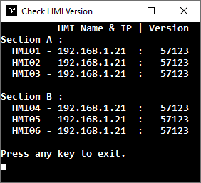

# Check HMI Version
A simple application to check the HMI version on every HMI client with InTouch Wonderware installed.

## Requirements
- Dotnet SDK 6.0 (Tested on SDK 6.0.315)
- Newtonsoft.Json 

## Installation
1. Download and install [Dotnet SDK 6.0](https://dotnet.microsoft.com/en-us/download/dotnet/6.0)
2. Download or clone this repo : `git clone https://github.com/fujianto21/check-hmi-version.git`
3. Enter the project directory
4. Install the package : `dotnet add package Newtonsoft.Json`
5. Run the project : `dotnet run`
6. Build the project : `dotnet build` or release the project : `dotnet publish -c Release`

## Setup
1. Edit HMI_LIST.json to add a new section or append HMI data to an existing section.
   ```json
   {
        "hmi": [
            {
                "section": {
                    "name": "Section A",
                    "data": [
                        {
                            "hmi_name": "HMI01",
                            "hmi_ip": "192.168.1.1",
                            "ini_file_path": "\\D$\\Fujianto\\code_csharp\\Check_HMI_Version\\INTOUCH.INI"
                        },
                        {
                            "hmi_name": "HMI02",
                            "hmi_ip": "192.168.1.2",
                            "ini_file_path": "\\D$\\Fujianto\\code_csharp\\Check_HMI_Version\\INTOUCH.INI"
                        }
                    ]
                }
            },
            {
                "section": {
                    "name": "Section B",
                    "data": [
                        {
                            "hmi_name": "HMI03",
                            "hmi_ip": "192.168.1.3",
                            "ini_file_path": "\\D$\\Fujianto\\code_csharp\\Check_HMI_Version\\INTOUCH.INI"
                        },
                        {
                            "hmi_name": "HMI04",
                            "hmi_ip": "192.168.1.4",
                            "ini_file_path": "\\D$\\Fujianto\\code_csharp\\Check_HMI_Version\\INTOUCH.INI"
                        }
                    ]
                }
            }
        ]
    }
   ```
   **Note:** The INTOUCH.INI file is actually located in the Network Application Development (NAD) directory.
2. If you want to run the application on a 32-bit platform, modify the Check_HMI_Version.csproj and add the code `<PlatformTarget>x86</PlatformTarget>`, for example:
   
     ```xml
    <Project Sdk="Microsoft.NET.Sdk">

       <PropertyGroup>
           <!-- Other project properties -->
           <PlatformTarget>x86</PlatformTarget>
       </PropertyGroup>
     
    </Project>
     ```
## Screenshot

## Demo
Open the directory [demo_app](demo_app) and edit HMI_LIST.json then change `hmi_ip` to your local IP Address and `ini_file_path` according to the project directory.
